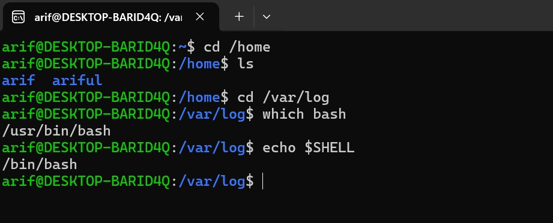
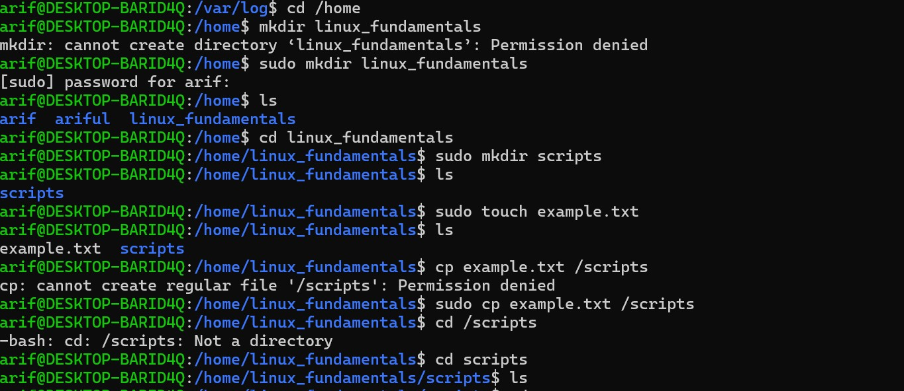
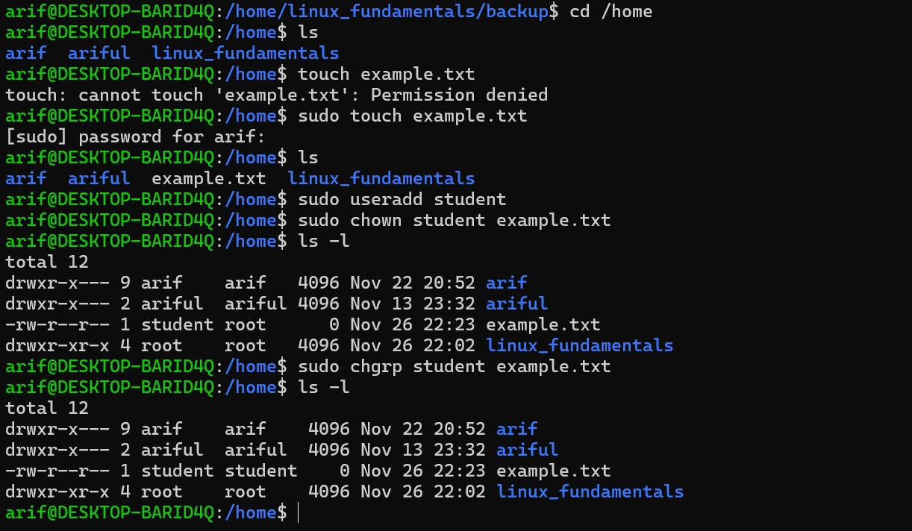
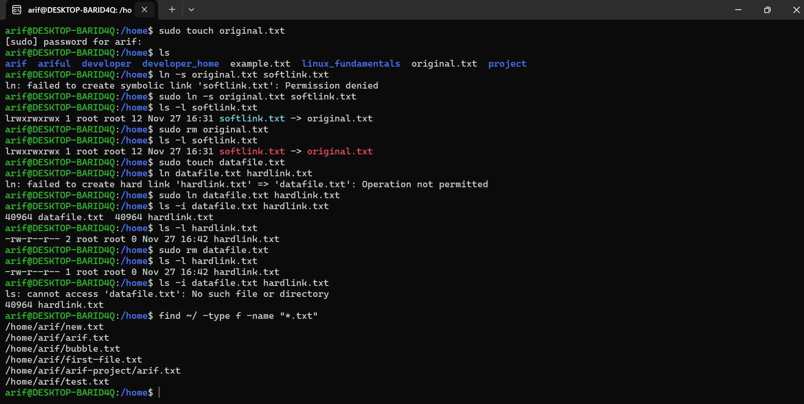

## Basic Linux commands

# File System Navigation

1. List the contents of the home directory.
```bash
$cd home
$ls
```
2. Change the current directory to /var/log and list its contents.
```bash
$cd /var/log
```
3. Find and display the path to the bash executable using the which command.
```bash
$which bash
```
4. Find current shell
```bash
$echo $SHELL
```
here are the screenshot of the following commands


# File and Directory Operations

1. Create a directory named linux_fundamentals in your home directory.
```bash
$cd /home
$sudo mkdir linux_fundamentals
$ls
```
2. Inside linux_fundamentals, create a subdirectory named scripts.
```
$cd linux_fundamentals
$sudo mkdir scripts
$ls
```
3. Create an empty file named example.txt inside the linux_fundamentals directory.
```bash
$sudo touch example.txt
```
4. Copy example.txt to the scripts directory.
```bash
$cp example.txt scripts
$cd /scripts
$ls
```
here are the screenshot of the following commands


5. Move example.txt from linux_fundamentals to linux_fundamentals/backup.
```bash
$cd linux_fundamentals
$sudo mkdir backup
$sudo mv example.txt backup
```
6. Change the permissions of example.txt to read and write for the owner, and read-only for the group and others.
```bash
$sudo chmod 644 example.txt
```
7. Verify the permission changes using ls -l
```bash
$ls -l
```
here are the screenshot of the following commands


# File Modification

1. Create a file named example.txt in your home directory.
```bash
$cd /home
$sudo touch example.txt
```
2. Change the owner of example.txt to a user named student
```bash
$sudo useradd student
$sudo chown student example.txt
```
3. Change the group of example.txt to a group named students.
```bash
$sudo chgrp students example.txt
```
4. Verify the changes using appropriate commands.
```bash
$ls -l
```
here are the screenshot of the following commands


# Ownership

1. Create a directory named project in your home directory.
```bash
$sudo mkdir project
```
2. Create a file named report.txt inside the project directory.
```bash
$cd project
$sudo touch report.txt
```
3. Set the permissions of report.txt to read and write for the owner, and read-only for the group and others.
```bash
$sudo chmod 644 report.txt
```
4. Set the permissions of the project directory to read, write, and execute for the owner, and read and execute for the group and others
```bash
$sudo chmod 755 project
```
5. Verify the changes using appropriate commands.
```bash
$ls -l
```
here are the screenshot of the following commands


# User add/modify

1. Create a new user named developer.
```bash
$sudo useradd -m developer
$grep developer /etc/passwd
```
2. Set the home directory of the user developer to /home/developer_home.
```bash
$sudo mkdir -p /home/developer_home
$sudo usermod -d /home/developer_home developer
```
3. Assign the shell /bin/sh to the user developer.
```bash
$sudo usermod -s /bin/sh developer
```
4. Verify the new user's information.
```bash
$grep developer /etc/passwd
```
5. Change the username of the user developer to devuser.
```bash
$sudo usermod -l devuser developer
```
6. Add devuser to a group named devgroup.
```bash
$sudo groupadd devgroup
$sudo usermod -aG devgroup devuser
```
7. Set the password of devuser to devpass. ( hint: use passwd command. Run passwd --help to see available options)
```bash
$sudo passwd devuser
```
8. Verify the changes made to the user.
```bash
$grep devuser /etc/passwd
```
here are the screenshot of the following commands


# Hard/Soft Link

1. Create a file named original.txt in your home directory.
```bash
$sudo touch original.txt
```
2. Create a symbolic link named softlink.txt pointing to original.txt.
```bash
$sudo ln -s original.txt softlink.txt
```
3. Verify the symbolic link and ensure it points to the correct file.
```bash
$ls -l softlink.txt
```
4. Delete the original file original.txt and observe the status of the symbolic link.
```bash
$ sudo rm original.txt
$ls -l softlink.txt
```
5. Create a file named datafile.txt in your home directory.
```bash
$sudo touch datafile.txt
```
6. Create a hard link named hardlink.txt pointing to datafile.txt.
```bash
$ln datafile.txt hardlink.txt
```
7. Verify the hard link and ensure it correctly points to the file.
```bash
$ls -l datafile.txt hardlink.txt
```
8. Check the inode of both datafile.txt and hardlink.txt
```bash
$ls -i datafile.txt hardlink.txt
```
9. Delete the original file datafile.txt and observe the status of the hard link.
```bash
$sudo rm datafile.txt
```
10. Find all .txt files in your home directory. ( use find command. Run find --help for usage)
```bash
$find ~/ -type f -name "*.txt"
```
here are the screenshot of the following commands


# Package installation

1. Update repo cache using apt/apt-get
```bash
$sudo apt update
```
2. Install a package named tree
```bash
$sudo apt install tree
```
here are the screenshot of the following commands


3. Install gcloud CLI tool using apt ( Follow instructions from here: https://cloud.google.com/sdk/docs/install#deb )
```
$sudo apt update
$udo apt install apt-transport-https ca-certificates gnupg
$echo "deb [signed-by=/usr/share/keyrings/cloud.google.gpg] https://packages.cloud.google.com/apt cloud-sdk main" | sudo tee -a /etc/apt/sources.list.d/google-cloud-sdk.list
$curl https://packages.cloud.google.com/apt/doc/apt-key.gpg | sudo tee /usr/share/keyrings/cloud.google.gpg > /dev/null
$sudo apt update
$sudo apt install google-cloud-sdk
$gcloud --version
$gcloud init
```
